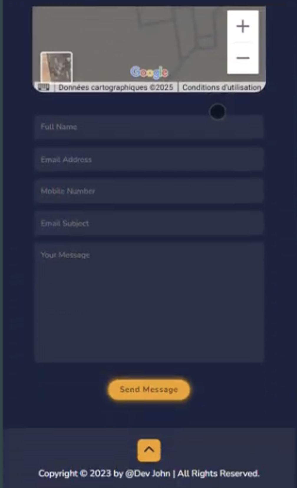
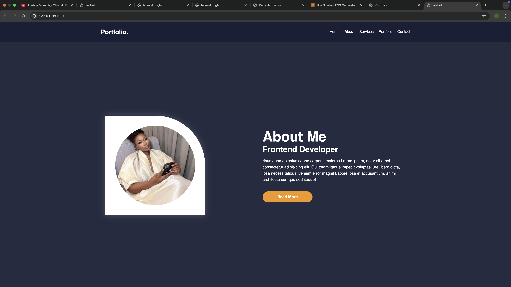
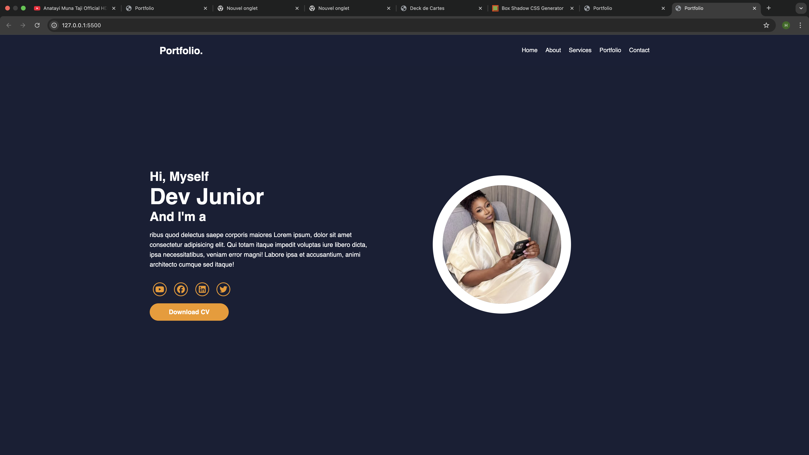

# Portfolio Web -- Modern Responsive Portfolio projet N°7

Ce projet est un site web de **portfolio personnel**responsive, conçu pour présenter le profil d’un développeur (ou apprenant) de manière professionnelle. Il s’agit d’une page unique (one-page) comprenant les sections suivantes : **Accueil (Home)** : Présentation rapide avec nom, titre et animation de texte dynamique (via Typed.js). **À propos (About)**: Informations sur le parcours, les compétences et une image illustrative. **Services (Services)** : Liste des domaines d’expertise (Développement Web, UI/UX Design, Développement Mobile). Portfolio (Projects) : Galerie de réalisations avec effets visuels sur survol. **Contact (Contact)** : Formulaire de contact et carte Google Maps intégrée. Pied de page (Footer) : Mention légale et bouton de retour en haut. Le design repose sur Flexbox et CSS Grid, avec un thème sombre moderne et des animations interactives.
## Fonctionnalités
-   Section d'accueil
-   À propos de moi
-   Compétences & Services
-   Galerie de projets
-   Contact avec formulaire
-   Carte Google Maps intégrée
-   Footer moderne avec icônes sociales
-   Mode responsive complet :
    -   Desktop
    -    Mobile
    -   Tablet  (1024px optimisation des images en grille 2x2)
##  Technologies utilisées

  Technologie             Rôle
  ----------------------- ----------------
  HTML5                   Structure
  CSS3 (Grid & Flexbox)   Style & Layout
  FontAwesome             Icônes

## Points clés du responsive design

-   **Section portfolio** en `grid-template-columns: repeat(2, 1fr)` à
    partir de 1024px
-   Formulaire aligné en colonne mobile
-   Footer icônes au-dessus du texte en mode mobile

## Structure des dossiers

    /portfolio
    │── index.html
    │── style.css
    │   ├── images/
    │   └── icons/
    └── README.md

## Capture

## Capture

## Capture
